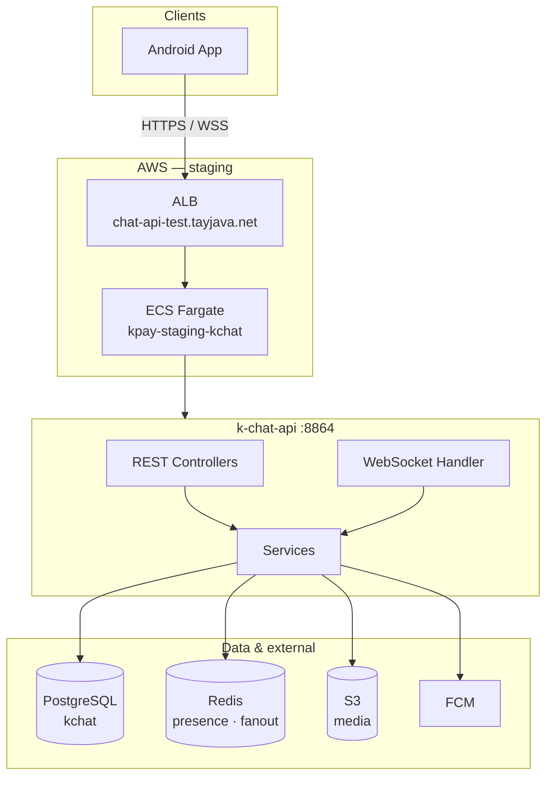
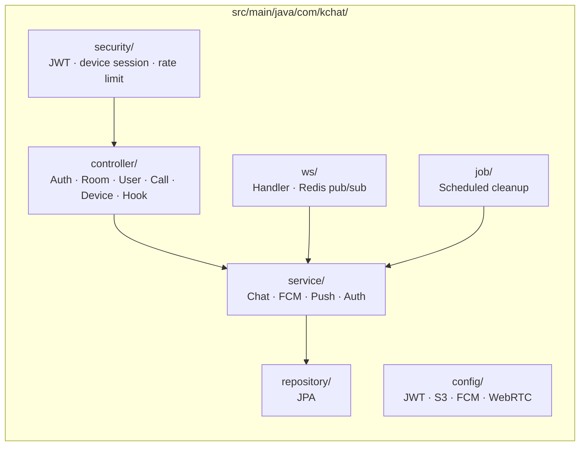
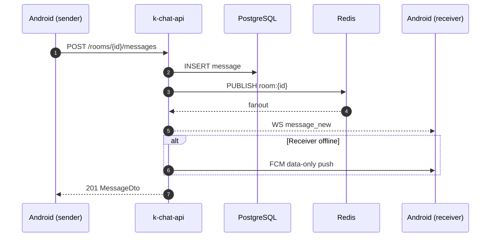
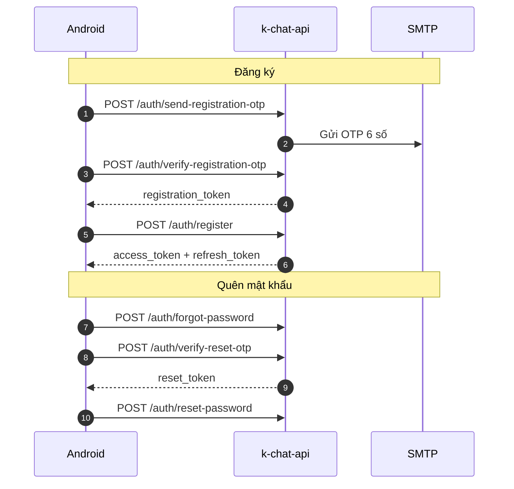
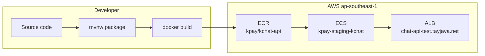

# k-chat-api

> Backend chat nội bộ · REST + WebSocket · JWT · FCM · S3

| | | |
|:--|:--|:--|
| **Port** | `8864` | **Package** `com.kchat` |
| **DB** | PostgreSQL `kchat` | **Profile** `dev` / `prod` |

---

## Tech stack

| Layer | Công nghệ |
|:------|:----------|
| Runtime | Java 21 · Spring Boot 3.5.x · Maven |
| API | REST (JSON snake_case) · SpringDoc / Swagger |
| Realtime | WebSocket · Redis Pub/Sub |
| Persistence | JPA / Hibernate · Flyway |
| Auth | JWT access + refresh · `X-Device-Token` |
| Media | S3 presigned URL |
| Push | Firebase Admin · FCM data-only |
| Calls | WebRTC signaling (WS) · STUN / TURN |
| Jobs | ShedLock · disappearing messages · call timeout |
| Deploy | Docker → ECR → ECS Fargate |

---

## Kiến trúc hệ thống



### Cấu trúc package



> Chi tiết: [`../docs/ARCHITECTURE.md`](../docs/ARCHITECTURE.md) · API: Swagger (dev) · [`../docs/BACKEND_PLAN.md`](../docs/BACKEND_PLAN.md)

---

## Luồng chính

### Gửi tin nhắn



### Auth (OTP)



**WebSocket:** `ws(s)://<host>/ws` · `Authorization: Bearer <token>` · `{ "type", "payload" }`

---

## Build & chạy local

**Cần:** JDK 21 · PostgreSQL · Redis · S3 (tuỳ chọn)

```bash
cd k-chat/backend

export DB_URL=jdbc:postgresql://localhost:5432/kchat
export DB_USER=admin DB_PASSWORD=123
export REDIS_HOST=localhost REDIS_PORT=6379 REDIS_PASSWORD=redis123

./mvnw spring-boot:run
```

| Endpoint | URL |
|:---------|:----|
| Health | http://localhost:8864/actuator/health |
| Swagger | http://localhost:8864/swagger-ui.html |
| WebSocket | ws://localhost:8864/ws |

```bash
# DB lần đầu
psql -U admin -d kchat -f ../docs/sql/kchat-schema.sql
psql -U admin -d kchat -f ../docs/sql/kchat-seed.sql   # tuỳ chọn — nguyenva / password

# Build
./mvnw test
./mvnw -DskipTests package
docker build -t kchat-api .
```

Env: [`.env.example`](./.env.example) · OTP email: `KCHAT_PASSWORD_RESET_MAIL_ENABLED=true` + `SMTP_*`

---

## Deploy staging



| | |
|:--|:--|
| REST | https://chat-api-test.tayjava.net/ |
| WS | wss://chat-api-test.tayjava.net/ws |
| ECS | `kpay-staging-kchat` |

Chạy từ root **`kpay/`**:

```bash
./infra/scripts/start-staging.sh --wait
./infra/scripts/deploy-staging.sh kchat --wait
curl -sS https://chat-api-test.tayjava.net/actuator/health
```

| Tình huống | Lệnh |
|:-----------|:-----|
| Chỉ push image | `cd k-chat/backend && ./scripts/push-ecr.sh` |
| Redeploy | `./infra/scripts/redeploy-staging.sh kchat --wait` |
| DB trống | `./infra/scripts/seed-staging-kchat.sh` |
| Bật FCM | `./infra/scripts/enable-staging-kchat-fcm.sh` |
| Terraform | [`infra/terraform/README.md`](../../infra/terraform/README.md) § 4b |

> Staging **không seed user** — đăng ký qua app Android.  
> Prod ECS: `SPRING_PROFILES_ACTIVE=prod` · secrets trong Secrets Manager — [`Dockerfile`](./Dockerfile)  
> Ops: [`infra/scripts/README.md`](../../infra/scripts/README.md)

---

## Cấu hình

| Variable | Dev | Ghi chú |
|:---------|:----|:--------|
| `DB_*` | localhost `kchat` | Bắt buộc |
| `REDIS_*` | `:6379` | WS fanout |
| `JWT_ACCESS_SECRET` | dev default | Đổi trên prod |
| `KCHAT_S3_BUCKET` | trống | Media upload |
| `KCHAT_FCM_ENABLED` | `false` | Staging: Terraform |
| `KCHAT_PASSWORD_RESET_MAIL_ENABLED` | `false` | OTP email |

[`application.yml`](./src/main/resources/application.yml) · [`.env.example`](./.env.example)

---

## Tài liệu

| | |
|:--|:--|
| Yêu cầu | [`REQUIREMENTS.md`](../docs/REQUIREMENTS.md) |
| Kiến trúc | [`ARCHITECTURE.md`](../docs/ARCHITECTURE.md) |
| DB schema | [`DB_SCHEMA.md`](../docs/DB_SCHEMA.md) |
| Android | [`android/README.md`](../android/README.md) |
| Backlog | [`BACKLOG.md`](../docs/BACKLOG.md) |
